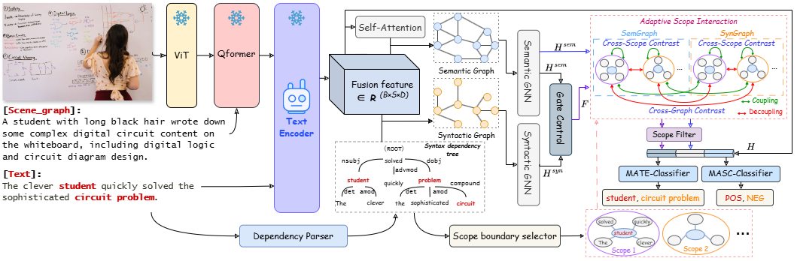

# Dependency Structure Augmented Contextual Scoping Framework for Multimodal Aspect-Based Sentiment Analysis

This is the official PyTorch implementation for the paper: **"Dependency Structure Augmented Contextual Scoping Framework for Multimodal Aspect-Based Sentiment Analysis"**.
### 📄Read the Paper  [here](https://arxiv.org/abs/2504.11331)

## 1. Overview
Multimodal Aspect-Based Sentiment Analysis (MABSA) seeks to extract fine-grained information from image-text pairs to identify aspect terms and determine their sentiment polarity. However, existing approaches often struggle to simultaneously address three core challenges: Sentiment Cue Perception (SCP), Multimodal Information Misalignment
(MIM), and Semantic Noise Elimination (SNE). To overcome these limitations, we propose DASCO (Dependency Structure Augmented Scoping Framework), a fine-grained scope-oriented framework. We introduce a continue pretraining strategy, combining aspect-oriented enhancement, imagetext matching, and aspect-level sentiment-sensitive cognition,
which strengthens the model’s perception of aspect terms and sentiment cues while achieving effective image-text alignment, addressing key challenges like SCP and MIM. Furthermore, DASCO integrates a syntactic-semantic dual-branch architecture that leverages dependency structures to construct target-specific scopes and employs adaptive scope interaction to guide the model to focus on target-relevant context while filtering out noise, thereby alleviating the SNE challenge. Extensive experiments on two benchmark datasets across three subtasks demonstrate that DASCO achieves state-of-the-art performance, with notable gains in JMASA (+2.3% F1 and +3.5% precision on Twitter2015).

### Framework Architecture
The architecture of our proposed DASCO:


## 2. Environment Setup
```bash
# Create the conda environment (we use Python 3.8)
conda create -n dasco python=3.8 -y
# Activate the environment
conda activate dasco
pip install -r requirements.txt
accelerate config --config_file deepspeed_ddp.json
```

## 3. Dataset
All required datasets, pre-trained models, and fine-tuned checkpoints are available at the following Google Drive link:**[Download Data & Models (Google Drive)](https://drive.google.com/drive/folders/1mG2wp-hmgKRTOa3vyfadal6JgNBuNrEj?usp=sharing)**

After downloading, please organize the folders as follows. Ensure the final directory structure inside your cloned `DASCO` repository matches this:

```
DASCO/                          <-- This is your repository root
│
├── Text_encoder/
│   ├── model_best/             <-- Place the 'model_best' folder here
│   └── ... 
│
├── finetune_dataset/           <-- Place the 'finetune_dataset' folder here
│
├── checkpoints/                <-- Place the 'checkpoints' folder here
│
└── ...                         (other project files like requirements.txt, etc.)
```


**Notes on the `checkpoints` directory:**

* `checkpoints/MATE_pretrain/mate.pt`: These are the pre-trained MATE weights. You can use this file to fine-tune on both the 2015 and 2017 datasets.
* `checkpoints/MASC_pretrain/masc2015.pt`: Pre-trained MASC weights for the 2015 dataset.
* `checkpoints/MASC_pretrain/masc2017.pt`: Pre-trained MASC weights for the 2017 dataset.
* Other folders (e.g., `MATE_2015`, `MASC_2017`, etc.) contain the final fine-tuned models, which can be used directly for inference.

## 4. Usage
### $Finetune$
To finetune the MATE model, run the `train_MATE.sh` script.

```bash
bash train_MATE.sh
```

This script sets the required environment variables and launches the training process using accelerate. The contents of train_MATE.sh are provided below. (Note: You can modify parameters such as --train_ds, --eval_ds, or --save_path inside this file to run different experiments.)
```bash
#!/bin/bash
export NCCL_P2P_DISABLE=1  # our devices is RTX 4090
# export HF_HUB_OFFLINE=1
export CUDA_VISIBLE_DEVICES="1,2,3,4"

accelerate launch --config_file deepspeed_ddp.json MATE_finetune.py \
    --task MATE \
    --base_model ./Text_encoder/model_best \
    --pretrain_model ./checkpoints/MATE_pretrain/mate.pt \
    --train_ds ./finetune_dataset/twitter15/train \
    --eval_ds ./finetune_dataset/twitter15/dev \
    --hyper1 0.2 \
    --hyper2 0.2 \
    --hyper3 0.2 \
    --gcn_layers 4 \
    --lr 2e-5 \
    --seed 1000 \
    --itc 0 \
    --itm 0 \
    --lm  0 \
    --cl  1.0 \
    --save_path ./checkpoints/MATE_2015_0 \
    --epoch 20 \
    --log_step 1 \
    --save_step 200 \
    --batch_size 4 \
    --accumulation_steps 2 \
    --val_step 50
```

To fine-tune the MASC model, run the corresponding bash script, similar to MATE:

```bash
bash train_MASC.sh
```

*Important*: When fine-tuning MASC, be sure to select the correct pre-trained weights. If you are training on the Twitter 2015 dataset, you must set --pretrain_model to ./checkpoints/MASC_pretrain/masc2015.pt. Likewise, for the Twitter 2017 dataset, use ./checkpoints/MASC_pretrain/masc2017.pt.

The contents of train_MASC.sh (configured for Twitter 2015) are shown below:

```bash
#!/bin/bash
export NCCL_P2P_DISABLE=1
# export HF_HUB_OFFLINE=1
export CUDA_VISIBLE_DEVICES="1,2,3,4"

accelerate launch --config_file deepspeed_ddp.json MASC_finetune.py \
    --task MASC \
    --base_model ./Text_encoder/model_best \
    --pretrain_model ./checkpoints/MASC_pretrain/masc2015.pt \  ### change here
    --train_ds ./finetune_dataset/twitter15/train \
    --eval_ds ./finetune_dataset/twitter15/dev \
    --hyper1 0.2 \
    --hyper2 0.2 \
    --hyper3 0.2 \
    --gcn_layers 4 \
    --lr 2e-5 \
    --seed 1000 \
    --itc 0 \
    --itm 0 \
    --lm  0 \
    --cl  1.0 \
    --save_path ./checkpoints/MASC_2015_0 \
    --epoch 20 \
    --log_step 1 \
    --save_step 200 \
    --batch_size 16 \
    --accumulation_steps 2 \
    --val_step 20
```

### $Inference$
To run inference and evaluation, we use the `eval.sh` script.

```bash
bash eval.sh
```

This script is designed to test checkpoint *folders* (since training saves multiple weights).

**Important:** The `eval.sh` file contains evaluation commands for all tasks (MATE, MASC, and MABSA). Before running, you **must** comment out the sections for the tasks you are not currently testing.

For example, to evaluate MATE, make sure only the commands under the `# MATE evaluation` section are active, and the MASC and MABSA sections are commented out.

## 5. Citation
If you find our work helpful for your research, please consider citing our paper:

```bibtex
@article{liu2025dasco,
  title         = {Dependency Structure Augmented Contextual Scoping Framework for Multimodal Aspect-Based Sentiment Analysis},
  author        = {Hao Liu and Lijun He and Jiaxi Liang and Zhihan Ren and Haixia Bi and Fan Li},
  journal       = {arXiv preprint arXiv:2504.11331},
  year          = {2025}
}
```

Finally, if you encounter any issues or have questions, feel free to open an issue.